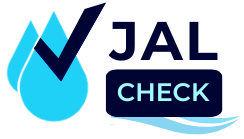
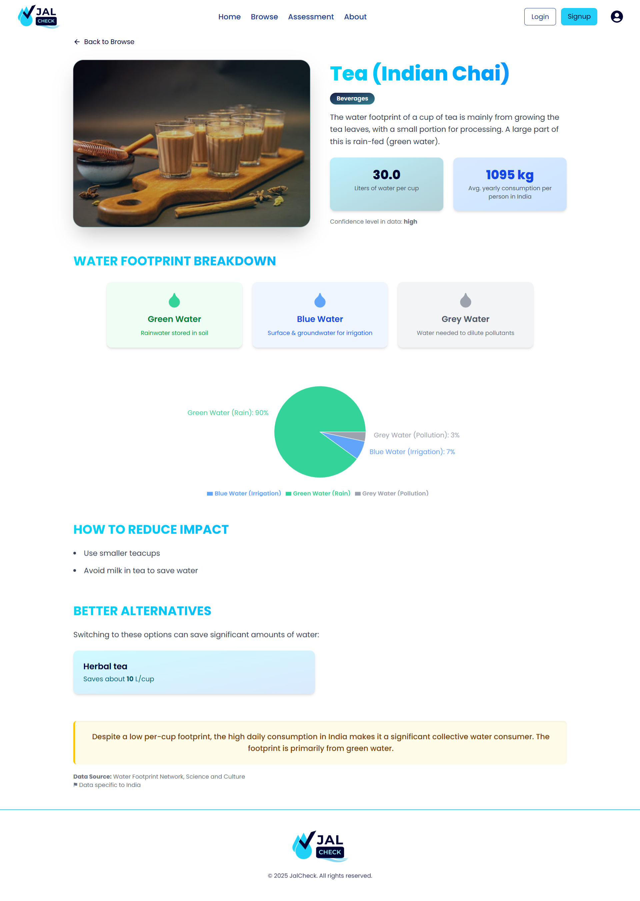
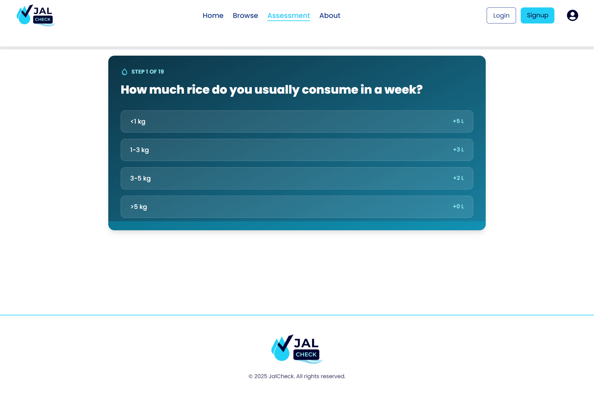
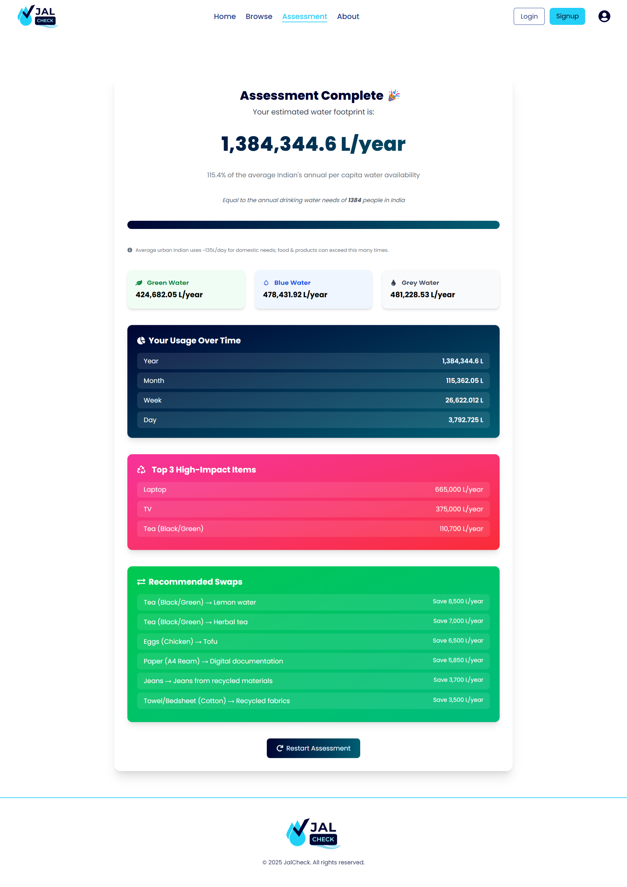

# 🌊 JalCheck – Track, Reduce & Rethink Your Water Footprint


<p align="center">
  
  <p width="150" align="center"><i>One Drop. One Choice. One Nation.</i></p>
</p>

**One-liner:**  
🚰 _Track, reduce, and rethink your water footprint - India-specific, product-level, and action-driven._

🔗 **Live Demo:** [https://jal-check.vercel.app/](https://jal-check.vercel.app/)  
📑 **Pitch Deck (PPT):** [View Presentation](docs/JalCheck.pptx)

<p align="center">
  
  
  
</p>

---

## 📌 Problem Statement

India is facing a **severe water crisis**:

- ⚠️ **70% of water contaminated** (NITI Aayog)
- ⚠️ By **2030**, demand will **double supply**
- ⚠️ Citizens are **unaware of hidden water footprints** (e.g., 1 cotton shirt = 2,700L water)

Existing solutions = too generic, global-focused, no instant alternatives.  
👉 **JalCheck fills this gap with an India-first, action-driven solution.**

---

## 🌟 Key Features

✨ **India-Specific Database** - Tailored for Indian households & products.  
🔍 **Search & Assess** - Find hidden footprints of common items.  
♻️ **Sustainable Alternatives** - Instantly discover eco-friendly swaps.  
📊 **Track & Share Impact** - Monitor litres saved per year.  
🎮 **Gamified Awareness** - Simple, engaging UI that educates as you use.

---


## 📂 Project Structure

```bash
jalcheck/
├── frontend/               # React + Tailwind frontend
│   ├── public/             # Static assets (logo, images, favicon)
│   ├── src/
│   │   ├── assets/         # Icons, illustrations, data
│   │   ├── components/     # Reusable UI components
│   │   ├── pages/          # Home, Browse, Detail, Assessment, Result
│   │   ├── router.jsx         # App routing config
│   │   ├── utils/          # Helper functions (calculations, data parsing)
│   │   └── App.jsx         # Root app file
│   └── package.json
├── docs/                   # PPT, PDF 
├── screenshots/            # UI screenshots for README
└── README.md               # Project overview
```

---


## 📸 Screenshots

<div align="center">

<table>
  <tr>
    <td align="center" width="50%">
    <h3>🌍 Home Page – Awareness & Entry Point</h3>
      
    </td>
    <td align="center" width="50%">
    <h3>🛒 Browse Products – Explore water footprint of daily items</h3>
      
      <br/>
    </td>
  </tr>
  <tr>
    <td align="center">
    <h3>📦 Product Detail – Footprint breakdown & alternatives</h3>
      
      <br/>
    </td>
    <td align="center">
    <h3>📝 Assessment – Personalized footprint calculator</h3>
      
      <br/>
    </td>
  </tr>
  <tr>
    <td align="center" colspan="2">
    <h3>📊 Result – Breakdown, high-impact items, and recommended swaps</h3>
      
      <br/>
    </td>
  </tr>
</table>

</div>

## 🛠️ Tech Stack

- **Frontend:** React, TailwindCSS, Framer Motion
- **Backend:** Node.js, Express.js
- **Database:** MongoDB
- **Tools:** Git, VS Code

<p align="center">
  
  
  
  <br/>
  
  
  
  <br/>
  
  
</p>

<p align="center">(Currently frontend-only MVP. Backend & DB modules designed but not integrated in this demo.)</p>
---

## ⚙️ Installation & Usage

1. Clone the repo

```bash
git clone https://github.com/HawaleShailesh004/JalCheck
cd jalcheck
cd frontend
```

2. Install Dependencies

```bash
npm install
```

3. Run Locally

```bash
npm run dev
```

4. Visit http://localhost:5173

## Future Roadmap

- 📊 **Expand database** (50 → 500+ products)
- 🌐 **Support local languages** (Hindi, Marathi, etc.)
- 🤖 **AI-powered personalized reports & QnA**
- 🛒 **E-commerce integration** for sustainable swap badges
- 📱 **Mobile App (React Native)** for mass adoption in India.

---

## 👨‍💻 Author

**Shailesh Hawale**

- 🌐 [https://linkedin.com/in/shailesh-hawale](https://linkedin.com/in/shailesh-hawale)
- 📧 shaileshhawale004@gmail.com

---

## 📜 License

This project is licensed under the **MIT License**.

---

## 🙌 Acknowledgements

- Built for **DigiGreen Recycling Software Development Intern Hiring Challenge 2025**
- Inspired by **global water footprint research + Indian sustainability data**
